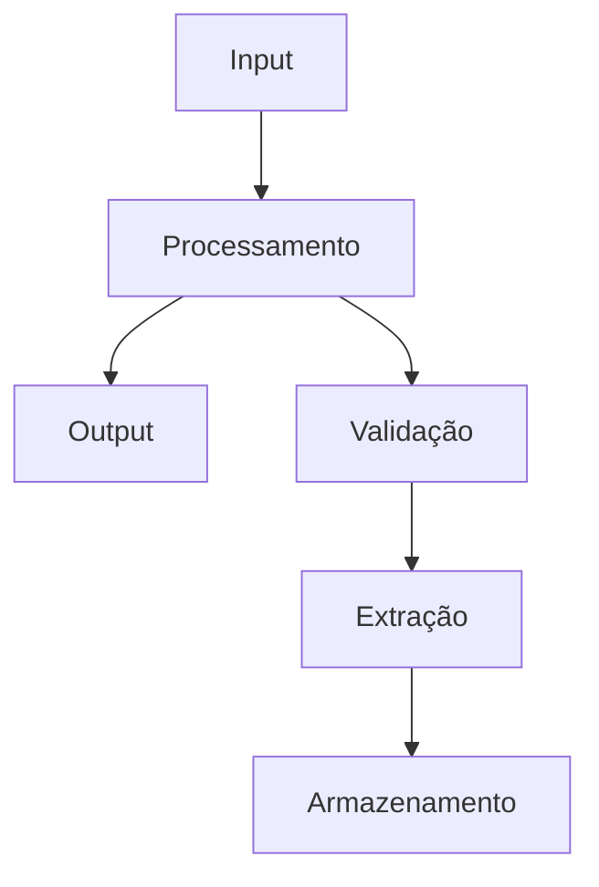

## ✨ Resumo da Feature

**Uma descrição clara e concisa da feature que você gostaria de ver implementada.**

Exemplo: "Adicionar suporte para extração de dados de múltiplas especialidades médicas simultaneamente"

## 🎯 Problema que Resolve

**Uma descrição clara do problema que esta feature resolveria.**

Ex: "Atualmente preciso executar o scraper múltiplas vezes para diferentes especialidades, o que é ineficiente e consome muito tempo..."

## 💡 Solução Proposta

**Uma descrição clara e concisa do que você quer que aconteça.**

### Funcionalidades Principais

- Descreva as principais funcionalidades da feature
- Liste os benefícios esperados
- Explique como será usada pelos usuários

### Exemplo de Uso

```bash
# Como a feature seria usada
python main.py scrape --specialties "cardiologia,dermatologia,pediatria" --batch-mode
```

## 🔄 Alternativas Consideradas

**Uma descrição clara e concisa de quaisquer soluções ou features alternativas que você considerou.**

- **Alternativa 1**: Descrição e por que foi descartada
- **Alternativa 2**: Descrição e por que foi descartada
- **Status Quo**: Por que manter como está não é ideal

## 📋 Detalhes de Implementação

**Se você tem ideias sobre como implementar, descreva aqui:**

### Arquitetura Sugerida

- [ ] **API Changes**: Novos endpoints ou modificações na API REST
- [ ] **Database Changes**: Novos campos ou tabelas necessárias
- [ ] **UI Changes**: Modificações na dashboard/interface web
- [ ] **Configuration**: Novos parâmetros de configuração
- [ ] **Dependencies**: Bibliotecas adicionais necessárias

### Componentes Afetados

- [ ] `src/scraper.py` - Lógica de scraping
- [ ] `src/api.py` - Endpoints da API
- [ ] `src/dashboard.py` - Interface web
- [ ] `config/settings.py` - Configurações
- [ ] `scripts/` - Scripts de automação

### Estimativa de Complexidade

- [ ] **Baixa**: 1-2 dias de desenvolvimento
- [ ] **Média**: 1 semana de desenvolvimento
- [ ] **Alta**: 2-4 semanas de desenvolvimento
- [ ] **Muito Alta**: 1+ mês de desenvolvimento

## 📊 Impacto e Benefícios

### Benefícios Esperados

- **Produtividade**: Quantificação do ganho de produtividade
- **Performance**: Impacto na velocidade de processamento
- **Usabilidade**: Melhorias na experiência do usuário
- **Manutenibilidade**: Facilidade de manutenção futura

### Usuários Afetados

- [ ] **Usuários Finais**: Impacto nos usuários do sistema
- [ ] **Desenvolvedores**: Mudanças no código/desenvolvimento
- [ ] **Administradores**: Impacto na administração do sistema

## 📸 Mockups/Wireframes

**Se aplicável, adicione mockups, diagramas ou wireframes:**

### Diagrama de Fluxo



Adicione screenshots ou diagramas aqui

## 🔍 Contexto Adicional

**Adicione qualquer outro contexto sobre a feature request:**

### Casos de Uso Específicos

- Cenário 1: Descrição detalhada
- Cenário 2: Descrição detalhada
- Cenário 3: Descrição detalhada

### Métricas de Sucesso

- Como medir se a feature foi bem-sucedida
- KPIs relevantes para acompanhar
- Critérios de aceitação

### Dependências

- Features que devem ser implementadas antes
- Integrações necessárias com sistemas externos
- Requisitos de infraestrutura

## ☑️ Checklist de Validação

- [ ] Verifiquei que não existe feature similar já solicitada
- [ ] A feature se alinha com os objetivos do projeto
- [ ] Considerei o impacto na performance e escalabilidade
- [ ] Pensei sobre compatibilidade com versões anteriores
- [ ] Avaliei a complexidade de implementação vs benefício
- [ ] Considerei implicações de segurança e privacidade
- [ ] Documentei casos de uso e cenários de teste

## 📝 Notas Adicionais

**Qualquer informação adicional que possa ajudar na avaliação:**

- Prioridade relativa (Alta/Média/Baixa)
- Timeline desejada para implementação
- Disponibilidade para testar/dar feedback
- Referências ou inspiração de outras ferramentas
