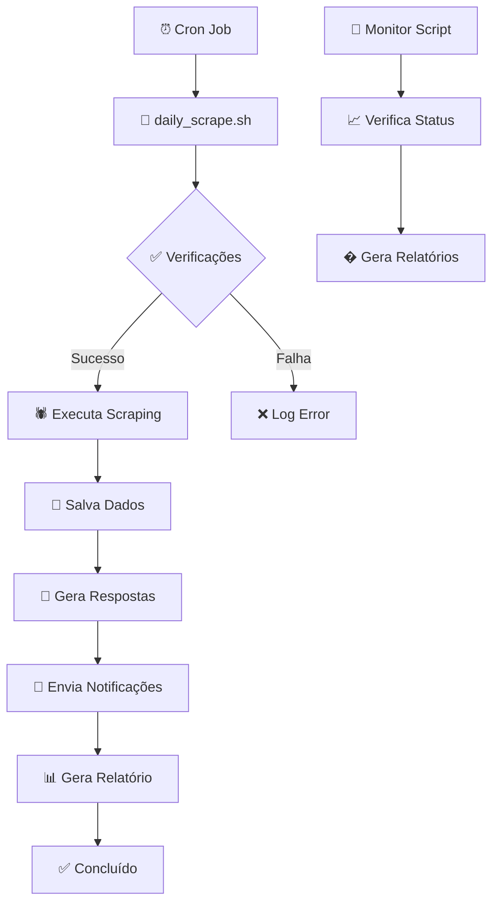

# ⏰ Daily Automation Setup

Este documento explica como configurar e gerenciar a automação diária de scraping para perfis médicos no Doctoralia.

## 🚀 Visão Geral

O sistema de automação diária permite executar scraping automaticamente todos os dias em um horário específico, ideal para:

- **Monitoramento contínuo** de avaliações
- **Respostas automáticas** a novas avaliações
- **Relatórios diários** de atividade
- **Backup automático** de dados

## 📊 Arquitetura da Automação



## ⚙️ Configuração Inicial

### 📋 Pré-requisitos

- **Sistema Linux** com cron instalado
- **Python 3.10+** e dependências instaladas
- **Google Chrome** para Selenium WebDriver
- **Permissões** para executar scripts

### 🛠️ Instalação Automática

```bash
# 1. Execute o script de setup
./scripts/setup.py

# 2. Configure a automação diária
./scripts/manage_daily_cron.sh setup

# 3. Teste a configuração
./scripts/manage_daily_cron.sh test
```

### ⚙️ Configuração Manual

#### **1. Criar Scripts Necessários**

```bash
# Criar diretório de scripts se não existir
mkdir -p scripts

# Criar script principal de scraping diário
cat > scripts/daily_scrape.sh << 'EOF'
#!/bin/bash
# Daily scraping automation script

# Configurações
SCRIPT_DIR="$(cd "$(dirname "${BASH_SOURCE[0]}")" && pwd)"
PROJECT_DIR="$(dirname "$SCRIPT_DIR")"
LOG_FILE="$PROJECT_DIR/data/logs/daily_scrape_$(date +%Y%m%d).log"

# Ativar ambiente virtual
cd "$PROJECT_DIR"
source venv/bin/activate 2>/dev/null || source .venv/bin/activate

# Executar scraping
echo "$(date): Iniciando scraping diário" >> "$LOG_FILE"
python main.py run --url "https://www.doctoralia.com.br/bruna-pinto-gomes/ginecologista/belo-horizonte" >> "$LOG_FILE" 2>&1

# Verificar resultado
if [ $? -eq 0 ]; then
    echo "$(date): Scraping concluído com sucesso" >> "$LOG_FILE"
else
    echo "$(date): ERRO no scraping" >> "$LOG_FILE"
fi
EOF

# Tornar executável
chmod +x scripts/daily_scrape.sh
```

#### **2. Configurar Cron Job**

```bash
# Editar crontab
crontab -e

# Adicionar linha para execução diária às 9:00
0 9 * * * /home/user/doctoralia-scraper/scripts/daily_scrape.sh

# Exemplos de outros horários:
# 0 8 * * *    # 8:00 AM todos os dias
# 0 12 * * 1-5 # 12:00 PM dias úteis
# 0 9,18 * * * # 9:00 AM e 6:00 PM
```

#### **3. Script de Gerenciamento**

```bash
cat > scripts/manage_daily_cron.sh << 'EOF'
#!/bin/bash
# Daily cron management script

SCRIPT_DIR="$(cd "$(dirname "${BASH_SOURCE[0]}")" && pwd)"
PROJECT_DIR="$(dirname "$SCRIPT_DIR")"
SCRIPT_PATH="$SCRIPT_DIR/daily_scrape.sh"
LOG_FILE="$PROJECT_DIR/data/logs/cron_management.log"

log() {
    echo "$(date): $1" >> "$LOG_FILE"
}

case "$1" in
    "start")
        log "Iniciando automação diária"
        (crontab -l ; echo "0 9 * * * $SCRIPT_PATH") | crontab -
        log "Automação configurada para executar diariamente às 9:00"
        ;;

    "stop")
        log "Parando automação diária"
        crontab -l | grep -v "$SCRIPT_PATH" | crontab -
        log "Automação diária removida"
        ;;

    "status")
        log "Verificando status da automação"
        if crontab -l | grep -q "$SCRIPT_PATH"; then
            echo "✅ Automação ATIVA - Executa diariamente às 9:00"
        else
            echo "❌ Automação INATIVA"
        fi
        ;;

    "test")
        log "Testando execução manual"
        echo "Executando teste do script diário..."
        "$SCRIPT_PATH"
        ;;

    "logs")
        echo "=== Últimas 20 linhas do log ==="
        tail -20 "$LOG_FILE"
        echo ""
        echo "=== Logs de execução diária ==="
        ls -la "$PROJECT_DIR/data/logs/daily_scrape_"* 2>/dev/null || echo "Nenhum log encontrado"
        ;;

    *)
        echo "Uso: $0 {start|stop|status|test|logs}"
        echo ""
        echo "Comandos:"
        echo "  start  - Iniciar automação diária"
        echo "  stop   - Parar automação diária"
        echo "  status - Verificar status"
        echo "  test   - Executar teste manual"
        echo "  logs   - Ver logs de execução"
        ;;
esac
EOF

chmod +x scripts/manage_daily_cron.sh
```

## 🛠️ Gerenciamento da Automação

### 📊 **Comandos de Gerenciamento**

```bash
# Verificar status
./scripts/manage_daily_cron.sh status

# Iniciar automação
./scripts/manage_daily_cron.sh start

# Parar automação
./scripts/manage_daily_cron.sh stop

# Executar teste manual
./scripts/manage_daily_cron.sh test

# Ver logs
./scripts/manage_daily_cron.sh logs
```

### 📈 **Monitoramento**

#### **Logs de Execução**

```bash
# Ver logs em tempo real
tail -f data/logs/daily_scrape_$(date +%Y%m%d).log

# Ver logs de gerenciamento
tail -f data/logs/cron_management.log

# Ver todos os logs de hoje
ls -la data/logs/*$(date +%Y%m%d)*
```

#### **Status do Sistema**

```bash
# Verificar se cron está rodando
systemctl status cron

# Ver jobs ativos do usuário
crontab -l

# Ver logs do sistema cron
sudo journalctl -u cron -f
```

### 📊 **Relatórios de Resultados**

```bash
# Script para verificar resultados diários
cat > scripts/check_daily_results.sh << 'EOF'
#!/bin/bash
# Check daily scraping results

SCRIPT_DIR="$(cd "$(dirname "${BASH_SOURCE[0]}")" && pwd)"
PROJECT_DIR="$(dirname "$SCRIPT_DIR")"

echo "=== 📊 RELATÓRIO DIÁRIO - $(date) ==="
echo ""

# Verificar último log de execução
LAST_LOG=$(ls -t "$PROJECT_DIR/data/logs/daily_scrape_"* 2>/dev/null | head -1)
if [ -n "$LAST_LOG" ]; then
    echo "📜 Último log de execução:"
    echo "   Arquivo: $(basename "$LAST_LOG")"
    echo "   Tamanho: $(stat -f%z "$LAST_LOG" 2>/dev/null || stat -c%s "$LAST_LOG") bytes"
    echo ""

    # Mostrar últimas linhas do log
    echo "📝 Últimas 10 linhas do log:"
    tail -10 "$LAST_LOG"
    echo ""
fi

# Verificar dados extraídos hoje
TODAY_DIR="$PROJECT_DIR/data/extractions/$(date +%Y%m%d)_*"
if ls $TODAY_DIR 2>/dev/null | grep -q .; then
    echo "📁 Dados extraídos hoje:"
    for dir in $TODAY_DIR; do
        if [ -d "$dir" ]; then
            echo "   📂 $(basename "$dir")"
            # Contar arquivos JSON
            json_count=$(find "$dir" -name "*.json" 2>/dev/null | wc -l)
            echo "      📄 $json_count arquivo(s) JSON encontrado(s)"
        fi
    done
else
    echo "📁 Nenhum dado extraído hoje"
fi

echo ""
echo "=== 🔔 NOTIFICAÇÕES ==="

# Verificar se Telegram está configurado
if [ -f "$PROJECT_DIR/config/config.json" ]; then
    if grep -q '"enabled": true' "$PROJECT_DIR/config/config.json" 2>/dev/null; then
        echo "✅ Telegram configurado - Notificações ativas"
    else
        echo "⚠️  Telegram não configurado"
    fi
else
    echo "❌ Arquivo de configuração não encontrado"
fi

echo ""
echo "=== 🎯 PRÓXIMAS EXECUÇÕES ==="
crontab -l | grep daily_scrape 2>/dev/null || echo "Nenhuma automação configurada"
EOF

chmod +x scripts/check_daily_results.sh
```

## 🔧 Personalização

### ⚙️ **Alterar Horário de Execução**

```bash
# Editar crontab diretamente
crontab -e

# Exemplos de horários:
# 0 6 * * *   # 6:00 AM (mais cedo)
# 0 12 * * *  # 12:00 PM (meio dia)
# 0 18 * * *  # 6:00 PM (final da tarde)
# 0 9 * * 1-5 # Apenas dias úteis
```

### 🎯 **Alterar URL do Médico**

```bash
# Editar script para nova URL
nano scripts/daily_scrape.sh

# Modificar a linha do comando python
python main.py run --url "SUA_NOVA_URL_AQUI"
```

### 📊 **Configurar Múltiplos Médicos**

```bash
# Criar script para múltiplos médicos
cat > scripts/multi_doctor_scrape.sh << 'EOF'
#!/bin/bash
# Multi-doctor daily scraping

doctors=(
    "https://www.doctoralia.com.br/medico1/especialidade/cidade"
    "https://www.doctoralia.com.br/medico2/especialidade/cidade"
    "https://www.doctoralia.com.br/medico3/especialidade/cidade"
)

for url in "${doctors[@]}"; do
    echo "$(date): Iniciando scraping para $url"
    python main.py run --url "$url"
    sleep 30  # Pausa entre execuções
done
EOF

chmod +x scripts/multi_doctor_scrape.sh
```

## 🚨 Troubleshooting

### 🔍 **Problemas Comuns**

#### **1. Script não executa**

```bash
# Verificar permissões
ls -la scripts/daily_scrape.sh

# Corrigir permissões
chmod +x scripts/daily_scrape.sh

# Testar execução manual
./scripts/daily_scrape.sh
```

#### **2. Ambiente virtual não encontrado**

```bash
# Verificar se venv existe
ls -la venv/  # ou .venv/

# Recriar ambiente virtual
python -m venv venv
source venv/bin/activate
pip install -r requirements.txt
```

#### **3. Chrome WebDriver falha**

```bash
# Verificar instalação do Chrome
google-chrome --version

# Instalar Chrome se necessário
# Ubuntu/Debian:
sudo apt update && sudo apt install google-chrome-stable

# CentOS/RHEL:
sudo yum install google-chrome-stable
```

#### **4. Cron não executa**

```bash
# Verificar status do cron
systemctl status cron

# Ver logs do cron
sudo journalctl -u cron -f

# Verificar sintaxe do crontab
crontab -l
```

### 🛠️ **Recuperação de Falhas**

```bash
# 1. Parar automação
./scripts/manage_daily_cron.sh stop

# 2. Executar teste manual
./scripts/manage_daily_cron.sh test

# 3. Verificar logs
./scripts/manage_daily_cron.sh logs

# 4. Corrigir problemas identificados

# 5. Reiniciar automação
./scripts/manage_daily_cron.sh start
```

## � Monitoramento Avançado

### �📈 **Dashboard de Automação**

```bash
# Criar dashboard simples para monitoramento
cat > scripts/automation_dashboard.sh << 'EOF'
#!/bin/bash
# Automation dashboard

echo "=== 🏥 DOCTORALIA AUTOMATION DASHBOARD ==="
echo "Data/Hora: $(date)"
echo ""

# Status da automação
echo "📊 STATUS DA AUTOMAÇÃO:"
./scripts/manage_daily_cron.sh status
echo ""

# Última execução
echo "⏰ ÚLTIMA EXECUÇÃO:"
LAST_LOG=$(ls -t data/logs/daily_scrape_* 2>/dev/null | head -1)
if [ -n "$LAST_LOG" ]; then
    echo "Arquivo: $(basename "$LAST_LOG")"
    echo "Últimas linhas:"
    tail -5 "$LAST_LOG"
else
    echo "Nenhuma execução encontrada"
fi
echo ""

# Estatísticas
echo "📈 ESTATÍSTICAS:"
echo "Total de execuções hoje: $(ls data/logs/daily_scrape_$(date +%Y%m%d)* 2>/dev/null | wc -l)"
echo "Total de extrações: $(find data/extractions -name "*.json" 2>/dev/null | wc -l)"
echo "Espaço usado: $(du -sh data/ 2>/dev/null | cut -f1)"
EOF

chmod +x scripts/automation_dashboard.sh
```

### 📧 **Relatórios por Email**

```bash
# Configurar relatório por email (requer mailutils)
cat > scripts/daily_report.sh << 'EOF'
#!/bin/bash
# Daily automation report via email

REPORT_FILE="/tmp/daily_report_$(date +%Y%m%d).txt"
./scripts/check_daily_results.sh > "$REPORT_FILE"

# Enviar por email (configurar destinatário)
mail -s "Doctoralia Daily Report - $(date +%Y-%m-%d)" seu-email@exemplo.com < "$REPORT_FILE"

# Limpar arquivo temporário
rm "$REPORT_FILE"
EOF

chmod +x scripts/daily_report.sh

# Adicionar ao crontab para executar após o scraping
# 30 9 * * * /home/user/doctoralia-scraper/scripts/daily_report.sh
```

## 🎯 Próximos Passos

### 📈 **Melhorias Sugeridas**

1. **Notificações por Email**: Integração com SMTP
2. **Dashboard Web**: Interface para monitoramento em tempo real
3. **Alertas Inteligentes**: Notificações baseadas em métricas
4. **Backup Automático**: Sincronização com cloud storage
5. **Multi-região**: Suporte a diferentes fusos horários

### 🔧 **Manutenção**

```bash
# Verificar saúde do sistema diariamente
0 8 * * * /home/user/doctoralia-scraper/scripts/system_diagnostic.py

# Limpar logs antigos (manter últimos 30 dias)
0 2 * * * find /home/user/doctoralia-scraper/data/logs -name "*.log" -mtime +30 -delete

# Backup semanal
0 3 * * 0 tar -czf /backup/doctoralia_$(date +%Y%m%d).tar.gz /home/user/doctoralia-scraper/data/
```

---

## 📞 Suporte

Para problemas com automação diária:

1. **Verifique logs**: `./scripts/manage_daily_cron.sh logs`
2. **Execute diagnóstico**: `python scripts/system_diagnostic.py`
3. **Teste manual**: `./scripts/manage_daily_cron.sh test`
4. **Verifique cron**: `systemctl status cron`

---

**🚀 Sistema de Automação Configurado com Sucesso!**

A automação diária está pronta para executar scraping automaticamente todos os dias às 9:00 AM, coletar dados, gerar respostas e enviar notificações.
