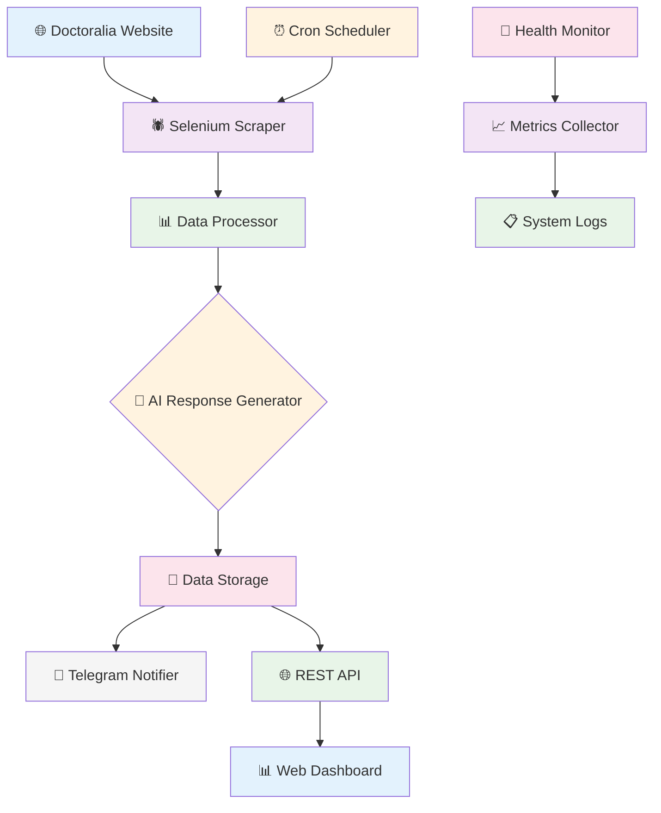

# 🏥 Doctoralia Scraper

Sistema automatizado para scraping de avaliações médicas, geração de respostas inteligentes e análise de qualidade com notificações via Telegram. Suporte multi-plataforma com dashboard web e API REST.

[](https://python.org)
[](LICENSE)
[](Makefile)
[](Makefile)

## 📋 Visão Geral

O **Doctoralia Scraper** é uma solução completa para profissionais médicos que desejam:

- 📊 **Monitorar avaliações** automaticamente em tempo real
- 🤖 **Gerar respostas inteligentes** usando IA e templates configuráveis
- 📱 **Receber notificações** instantâneas via Telegram
- 📈 **Analisar qualidade** das respostas com ML (NLTK VADER)
- 🌐 **Visualizar dados** através de dashboard web moderno
- 🔌 **Integrar sistemas** via API REST completa

### 🎯 **Casos de Uso**

- **Médicos individuais** que querem responder rapidamente às avaliações
- **Clínicas** que precisam monitorar múltiplos profissionais
- **Sistemas de gestão** que querem integrar dados de satisfação
- **Pesquisadores** que analisam padrões de avaliação médica

## 🚀 Funcionalidades Principais

### 🔍 **Scraping Inteligente**

- **Multi-plataforma**: Suporte extensível para Doctoralia e outras plataformas
- **Anti-detecção**: Técnicas avançadas para evitar bloqueios
- **Rate limiting**: Controle inteligente de frequência de requisições
- **Circuit breaker**: Proteção contra falhas em cascata
- **Retry automático**: Recuperação inteligente de erros temporários

### 🤖 **IA e Respostas Automáticas**

- **Templates configuráveis**: Respostas personalizadas por contexto
- **Análise de sentimento**: Classificação automática de comentários
- **Geração contextual**: Respostas adaptadas ao tipo de avaliação
- **Qualidade ML**: Análise com NLTK VADER para otimização
- **Batch processing**: Processamento em lote para eficiência

### 📊 **Monitoramento e Analytics**

- **Dashboard web**: Interface moderna com gráficos em tempo real
- **API REST**: Endpoints completos com documentação automática
- **Health checks**: Monitoramento proativo da saúde do sistema
- **Logs estruturados**: Logs JSON para análise e debugging
- **Performance metrics**: Métricas detalhadas de performance

### 📱 **Notificações e Alertas**

- **Telegram Bot**: Notificações instantâneas configuráveis
- **Templates personalizáveis**: Mensagens customizáveis por evento
- **Alertas inteligentes**: Notificações baseadas em severidade
- **Status em tempo real**: Acompanhamento de operações

## 🏗️ Arquitetura do Sistema



## � Sumário

- [🏥 Doctoralia Scraper](#-doctoralia-scraper)
  - [📋 Visão Geral](#-visão-geral)
  - [� Funcionalidades Principais](#-funcionalidades-principais)
  - [🏗️ Arquitetura do Sistema](#️-arquitetura-do-sistema)
- [⚡ Início Rápido](#-início-rápido)
- [🛠️ Instalação](#️-instalação)
- [⚙️ Configuração](#️-configuração)
- [🚀 Uso](#-uso)
- [📊 Dashboard Web](#-dashboard-web)
- [🔌 API REST](#-api-rest)
- [📁 Estrutura do Projeto](#-estrutura-do-projeto)
- [🔒 Segurança](#-segurança)
- [🧪 Testes](#-testes)
- [🐛 Troubleshooting](#-troubleshooting)
- [📄 Licença](#-licença)
- [🤝 Contribuição](#-contribuição)

---

## ⚡ Início Rápido

### 🎯 **Primeiros Passos**

```bash
# 1. Clone e instale
git clone <repository-url>
cd doctoralia-scraper
make install

# 2. Configure o sistema
make setup

# 3. Execute o primeiro scraping
make run-url URL=https://www.doctoralia.com.br/seu-medico/especialidade/cidade

# 4. Visualize os resultados
make dashboard
```

### 📊 **Fluxo Típico de Uso**

1. **Configuração Inicial** (5 min): Configure Telegram e preferências
2. **Primeiro Scraping** (2-3 min): Teste com uma URL específica
3. **Análise de Resultados** (5 min): Visualize dados no dashboard
4. **Configuração de Automação** (10 min): Configure execução automática
5. **Monitoramento Contínuo**: Acompanhe via dashboard e notificações

---

## 🛠️ Instalação

### 📦 **Pré-requisitos**

- **Python 3.10+**
- **Google Chrome** (para Selenium WebDriver)
- **Git** (para controle de versão)
- **Linux/macOS/Windows** (suporte multiplataforma)

### 🛠️ **Instalação Rápida**

1. **Clone o repositório:**

```bash
git clone <repository-url>
cd doctoralia-scraper
```

2. **Instale as dependências usando Poetry (Recomendado):**

```bash
# Instalar Poetry se não tiver
curl -sSL https://install.python-poetry.org | python3 -

# Instalar dependências
poetry install

# Ativar ambiente virtual
poetry shell
```

3. **Ou usando pip tradicional:**

```bash
pip install -r requirements.txt
```

4. **Configure as variáveis de ambiente (opcional):**

```bash
cp .env.example .env
# Edite o arquivo .env com suas configurações específicas
```

### ⚙️ **Configuração Inicial**

Execute a configuração inicial:

```bash
python main.py setup
```

Este comando irá:

- ✅ Configurar Telegram (opcional)
- ✅ Configurar scraping parameters
- ✅ Criar estrutura de diretórios
- ✅ Testar conexões

### 🏃‍♂️ **Verificação da Instalação**

Teste a instalação:

```bash
# Verificar status do sistema
python main.py status

# Executar diagnóstico completo
python scripts/system_diagnostic.py
```

### 📋 **Comandos Úteis**

```bash
# Ver todos os comandos disponíveis
make help

# Instalar dependências
make install

# Instalar dependências de desenvolvimento
make install-dev

# Configurar projeto
make setup

# Executar scraping
make run                    # Scraping interativo (solicita URL)
make run-url URL=<url>      # Scraping com URL específica
make run-full-url URL=<url> # Workflow completo com URL específica

# Executar testes
make test
```

## 🚀 Início Rápido

Após a instalação, você pode começar a usar o sistema imediatamente:

### 🎯 **Workflow Básico**

```bash
# 1. Configuração inicial (opcional, mas recomendado)
make setup

# 2. Fazer scraping de um médico específico
make run-url URL=https://www.doctoralia.com.br/seu-medico/especialidade/cidade

# 3. Ou executar o workflow completo (scraping + geração de respostas)
make run-full-url URL=https://www.doctoralia.com.br/seu-medico/especialidade/cidade

# 4. Verificar resultados
make status
```

## 📊 Dashboard Web

### 🚀 **Iniciar Dashboard**

```bash
# Usando Makefile (recomendado)
make dashboard

# Ou diretamente
python src/dashboard.py
```

### 🌐 **Acesso**

- **URL**: `http://localhost:5000`
- **Interface**: Moderna e responsiva
- **Gráficos**: Charts interativos em tempo real

### 📈 **Funcionalidades**

- **📊 Métricas em Tempo Real**: Performance, saúde do sistema, estatísticas
- **📋 Lista de Avaliações**: Visualização paginada com filtros
- **🔍 Busca Avançada**: Por data, médico, status de resposta
- **📈 Análise de Tendências**: Gráficos de evolução temporal
- **⚙️ Configurações**: Interface para ajustes do sistema
- **📱 Responsivo**: Funciona em desktop, tablet e mobile

### 🎨 **Interface Moderna**

```text
┌─────────────────────────────────────────────────┐
│                🏥 Doctoralia Dashboard           │
├─────────────────────────────────────────────────┤
│  📊 System Health: ✅ All Systems Operational    │
│  📈 Today's Scrapes: 3                          │
│  💬 Pending Responses: 12                       │
│                                                 │
│  📋 Recent Reviews                              │
│  ┌─────────────────────────────────────────────┐ │
│  │ ⭐⭐⭐⭐⭐ João Silva - Excelente atendimento   │ │
│  │ 📅 2025-01-15 14:30                        │ │
│  │ ⏳ Aguardando resposta                      │ │
│  └─────────────────────────────────────────────┘ │
│                                                 │
│  📊 Charts & Analytics                          │
│  [Bar Chart: Reviews by Rating]                 │
│  [Line Chart: Daily Activity]                    │
└─────────────────────────────────────────────────┘
```

---

## 🔌 API REST

### 🚀 **Iniciar API**

```bash
# Usando Makefile (recomendado)
make api

# Ou diretamente
python src/api.py
```

### 📚 **Documentação**

- **Swagger UI**: `http://localhost:8000/docs`
- **ReDoc**: `http://localhost:8000/redoc`
- **OpenAPI Schema**: `http://localhost:8000/openapi.json`

### 🎯 **Endpoints Principais**

#### **Scraping**

```http
POST /scrape
```

Inicia tarefa de scraping assíncrona

**Request Body:**

```json
{
  "doctor_urls": ["https://www.doctoralia.com.br/medico/especialidade/cidade"],
  "platform": "doctoralia",
  "include_reviews": true,
  "max_reviews": 50
}
```

**Response:**

```json
{
  "task_id": "scrape_20250115_143000_1",
  "status": "running",
  "message": "Scraping task started successfully"
}
```

#### **Análise de Qualidade**

```http
POST /analyze/quality
```

Analisa qualidade de uma resposta médica

**Request Body:**

```json
{
  "response_text": "Excelente atendimento, muito profissional!",
  "original_review": "Consulta muito boa, recomendo"
}
```

**Response:**

```json
{
  "quality_score": 0.85,
  "sentiment": "positive",
  "readability_score": 72.3,
  "recommendations": ["Considere adicionar mais detalhes específicos"]
}
```

#### **Monitoramento do Sistema**

```http
GET /health           # Health check completo
GET /statistics       # Estatísticas do sistema
GET /performance      # Métricas de performance
GET /tasks           # Lista de tarefas ativas
GET /tasks/{task_id} # Status específico de tarefa
```

### 🔧 **Exemplos de Uso**

#### **Scraping Programático**

```bash
# Iniciar scraping via API
curl -X POST "http://localhost:8000/scrape" \
  -H "Content-Type: application/json" \
  -d '{
    "doctor_urls": ["https://www.doctoralia.com.br/medico/especialidade/cidade"],
    "include_reviews": true
  }'

# Verificar status da tarefa
curl "http://localhost:8000/tasks/scrape_20250115_143000_1"
```

#### **Análise de Qualidade via API**

```bash
# Analisar resposta individual
curl -X POST "http://localhost:8000/analyze/quality" \
  -H "Content-Type: application/json" \
  -d '{
    "response_text": "Obrigado pelo feedback positivo!",
    "original_review": "Muito bom o atendimento"
  }'

# Análise em lote
curl -X POST "http://localhost:8000/analyze/quality/batch" \
  -H "Content-Type: application/json" \
  -d '{"analyses": [
    {"response_text": "Excelente!", "original_review": "Bom atendimento"},
    {"response_text": "Obrigado!", "original_review": "Consulta ok"}
  ]}'
```

#### **Monitoramento**

```bash
# Health check
curl "http://localhost:8000/health"

# Estatísticas do sistema
curl "http://localhost:8000/statistics"

# Lista de tarefas ativas
curl "http://localhost:8000/tasks"
```

## 🛠️ Configuração

### Telegram (Opcional)

Para receber notificações:

1. Crie um bot com [@BotFather](https://t.me/BotFather)
1. Obtenha o token do bot
1. Obtenha seu chat_id com [@userinfobot](https://t.me/userinfobot)
1. Execute `python main.py setup` e forneça as credenciais

### Configuração Manual

Edite o arquivo `config/config.json` com suas configurações:

```json
{
  "telegram": {
    "token": "seu_bot_token",
    "chat_id": "seu_chat_id",
    "enabled": true
  },
  "scraping": {
    "headless": true,
    "timeout": 60,
    "delay_min": 2.0,
    "delay_max": 4.0
  }
}
```

> **Nota**: Use o arquivo `config/config.example.json` como template. Consulte `config/README_TEMPLATES.md` para documentação detalhada sobre templates de resposta.

## � API REST

O sistema inclui uma API REST completa para integração programática:

### 🚀 **Endpoints Principais**

#### **Operações de Scraping**

```http
POST /scrape
```

Inicia tarefa de scraping assíncrona

```json
{
  "doctor_urls": ["https://www.doctoralia.com.br/medico/especialidade/cidade"],
  "platform": "doctoralia",
  "include_reviews": true,
  "max_reviews": 50
}
```

#### **Análise de Qualidade**

```http
POST /analyze/quality
```

Analisa qualidade de uma resposta médica

```json
{
  "response_text": "Excelente atendimento, muito profissional!",
  "original_review": "Consulta muito boa, recomendo"
}
```

#### **Tarefas**

```http
GET /tasks/{task_id}      # Status de tarefa
GET /tasks                # Lista todas as tarefas
DELETE /tasks/{task_id}   # Remove tarefa concluída
```

#### **Monitoramento**

```http
GET /statistics           # Estatísticas do sistema
GET /performance          # Métricas de performance
GET /platforms           # Plataformas suportadas
GET /health              # Health check
```

### 📚 **Documentação Interativa**

Acesse a documentação completa da API:

- **Swagger UI**: `http://localhost:8000/docs`
- **ReDoc**: `http://localhost:8000/redoc`
- **OpenAPI Schema**: `http://localhost:8000/openapi.json`

### 🔧 **Exemplos de Uso**

```bash
# Iniciar scraping via API
curl -X POST "http://localhost:8000/scrape" \
  -H "Content-Type: application/json" \
  -d '{
    "doctor_urls": ["https://www.doctoralia.com.br/medico/especialidade/cidade"],
    "include_reviews": true
  }'

# Verificar status da tarefa
curl "http://localhost:8000/tasks/scrape_20241201_120000_1"

# Analisar qualidade de resposta
curl -X POST "http://localhost:8000/analyze/quality" \
  -H "Content-Type: application/json" \
  -d '{
    "response_text": "Obrigado pelo feedback positivo!",
    "original_review": "Muito bom o atendimento"
  }'
```

## �📖 Uso

> **💡 Dica**: Execute `make help` para ver todos os comandos disponíveis com suas descrições.

### Comandos Principais

```bash
# Usando Makefile (recomendado)
make setup              # Configuração inicial
make run                # Executar scraping uma vez
make run-url URL=<url>  # Executar scraping com URL específica
make run-full-url URL=<url> # Executar workflow completo com URL específica
make generate           # Gerar respostas
make daemon             # Executar daemon (modo contínuo)
make daemon-debug       # Daemon em modo debug
make monitor            # Monitorar status
make status             # Mostrar status do sistema
make stop               # Parar daemon

# Usando Python diretamente
python main.py setup
python main.py scrape
python main.py scrape --url <url>
python main.py run --url <url>
python main.py generate
python main.py daemon --interval 30

# Novos recursos Priority 4
python src/dashboard.py     # Iniciar dashboard web
python src/api.py          # Iniciar API REST

# Scripts utilitários
python scripts/monitor_scraping.py
python scripts/system_diagnostic.py
```

### Executando com URL Específica

Para fazer scraping de um médico específico, você pode usar os novos comandos:

```bash
# Apenas scraping
make run-url URL=https://www.doctoralia.com.br/medico/especialidade/cidade

# Workflow completo (scraping + geração de respostas)
make run-full-url URL=https://www.doctoralia.com.br/medico/especialidade/cidade

# Exemplo prático
make run-url URL=https://www.doctoralia.com.br/bruna-pinto-gomes/ginecologista/belo-horizonte
make run-full-url URL=https://www.doctoralia.com.br/bruna-pinto-gomes/ginecologista/belo-horizonte
```

### Modo Daemon

O daemon executa o sistema continuamente:

```bash
# Usando Makefile
make daemon             # Iniciar daemon em background
make daemon-debug       # Iniciar daemon em modo debug
make stop               # Parar daemon em execução
make status             # Verificar status do daemon

# Usando Python diretamente
python main.py daemon --interval 30  # Iniciar com intervalo personalizado
python scripts/daemon.py stop        # Parar daemon
```

## 📁 Estrutura do Projeto

```text
doctoralia-scraper/
├── main.py                 # Interface principal
├── requirements.txt        # Dependências Python
├── requirements-dev.txt    # Dependências de desenvolvimento
├── pyproject.toml         # Configuração do projeto Python
├── setup.cfg              # Configuração de ferramentas
├── Makefile               # Comandos de automação
├── CONTRIBUTING.md        # Guia de contribuição
├── LICENSE                # Licença do projeto
├── .env.example           # Exemplo de variáveis de ambiente
├── templates/             # Templates HTML para dashboard
│   └── dashboard.html     # Template do dashboard web
├── config/                # Configurações
│   ├── __init__.py       # Módulo Python
│   ├── settings.py       # Classes de configuração
│   ├── templates.py      # Templates de resposta
│   ├── telegram_templates.py # Templates de notificação
│   ├── config.example.json # Exemplo de configuração
│   └── README_TEMPLATES.md # Documentação de templates
├── src/                   # Código fonte principal
│   ├── __init__.py       # Módulo Python
│   ├── api.py            # 🚀 API REST FastAPI
│   ├── dashboard.py      # 📊 Dashboard web Flask
│   ├── scraper.py        # Motor de scraping
│   ├── multi_site_scraper.py # 🔍 Suporte multi-plataforma
│   ├── response_generator.py # Gerador de respostas
│   ├── response_quality_analyzer.py # 🤖 Análise ML de qualidade
│   ├── performance_monitor.py # 📈 Monitor de performance
│   ├── telegram_notifier.py # Notificador Telegram
│   └── logger.py         # Sistema de logging
├── scripts/              # Scripts utilitários
│   ├── daemon.py        # Controle do daemon
│   ├── monitor_scraping.py # Monitor de status
│   ├── system_diagnostic.py # Diagnóstico
│   ├── setup.py         # Configuração automatizada
│   ├── install_deps.py  # Instalação de dependências
│   └── init.py          # Inicialização
├── tests/               # Testes automatizados
│   ├── conftest.py     # Configuração dos testes
│   ├── fixtures/       # Dados de teste
│   ├── integration/    # Testes de integração
│   └── unit/           # Testes unitários
└── data/                # Dados e logs
    ├── processed_reviews.json
    ├── scraped_data/    # 📁 Dados de scraping organizados
    ├── logs/           # Arquivos de log
    ├── responses/      # Respostas geradas
    └── extractions/    # Dados extraídos
```

## 🔧 Scripts Utilitários

- **`scripts/daemon.py`**: Controle do processo daemon
- **`scripts/monitor_scraping.py`**: Monitor de status em tempo real
- **`scripts/system_diagnostic.py`**: Diagnóstico completo do sistema
- **`scripts/setup.py`**: Configuração automatizada
- **`scripts/install_deps.py`**: Instalação de dependências
- **`scripts/init.py`**: Script de inicialização

## 📊 Logs e Dados

O sistema gera logs detalhados e armazena dados em `data/`:

### Estrutura de Logs (`data/logs/`)

- `scraper_YYYYMM.log`: Logs do processo de scraping
- `generator_YYYYMM.log`: Logs da geração de respostas
- `daemon_YYYYMM.log`: Logs do daemon
- `debug_html_YYYYMM.log`: Debug de HTML para troubleshooting
- `setup_YYYYMM.log`: Logs da configuração inicial
- `status_YYYYMM.log`: Logs de verificação de status

### Dados Processados

- `data/processed_reviews.json`: Avaliações já processadas
- `data/responses/`: Respostas geradas para cada avaliação
- `data/extractions/`: Dados extraídos organizados por data e médico
  - Cada extração contém:
    - `complete_data.json`: Dados completos
    - `extraction_summary.json`: Resumo da extração
    - `with_replies.json`: Avaliações com respostas
    - `without_replies.json`: Avaliações sem respostas

## 🔒 Segurança

- Nunca commite credenciais no repositório
- Use variáveis de ambiente para dados sensíveis
- O arquivo `config/config.json` está no .gitignore
- Tokens e chaves são armazenados localmente
- Use o arquivo `.env.example` como template para suas configurações

## 🧪 Testes

O projeto inclui testes automatizados organizados em:

```bash
# Usando Makefile (recomendado)
make test              # Executar todos os testes
make test-unit         # Executar testes unitários
make test-integration  # Executar testes de integração

# Usando pytest diretamente
python -m pytest                    # Todos os testes
python -m pytest tests/unit/        # Testes unitários
python -m pytest tests/integration/ # Testes de integração
python -m pytest --cov=src          # Com cobertura
```

### Estrutura de Testes

- **`tests/unit/`**: Testes unitários de componentes individuais
- **`tests/integration/`**: Testes de integração entre componentes
- **`tests/fixtures/`**: Dados de teste e fixtures
- **`conftest.py`**: Configurações compartilhadas dos testes

## 🛠️ Desenvolvimento

### Ambiente de Desenvolvimento

```bash
# Instalar dependências de desenvolvimento
make install-dev

# Formatar código
make format

# Verificar formatação sem alterar arquivos
make format-check

# Verificar estilo de código
make lint

# Executar verificações de segurança
make security

# Executar testes com cobertura HTML
make test-coverage

# Limpar arquivos temporários
make clean
```

### Qualidade de Código

O projeto utiliza várias ferramentas para manter a qualidade:

- **Black**: Formatação automática de código
- **isort**: Organização de imports
- **flake8**: Verificação de estilo
- **mypy**: Verificação de tipos
- **pylint**: Análise estática
- **bandit**: Verificação de segurança
- **safety**: Verificação de vulnerabilidades em dependências

### Configuração do Projeto

- **`pyproject.toml`**: Configuração moderna do projeto Python (PEP 518)
- **`setup.cfg`**: Configuração das ferramentas de qualidade
- **`requirements.txt`**: Dependências de produção
- **`requirements-dev.txt`**: Dependências de desenvolvimento

## 🐛 Troubleshooting

### Problemas Comuns

1. **Erro de WebDriver**: Instale o ChromeDriver compatível
1. **Timeout de Página**: Ajuste `scraping.timeout` na configuração
1. **Rate Limiting**: Aumente `delay_min` e `delay_max`

### Debug

Use o modo debug para análise detalhada:

```bash
python main.py scrape --debug
```

## 📄 Licença

Este projeto é privado e confidencial.

## 🤝 Contribuição

Para contribuir com o projeto, consulte o [Guia de Contribuição](CONTRIBUTING.md) completo.

### Processo Rápido

1. Faça um fork do repositório
1. Crie uma branch para sua feature: `git checkout -b feature/nova-funcionalidade`
1. Faça suas alterações seguindo os padrões de código
1. Execute os testes: `make test`
1. Commit suas mudanças: `git commit -m "feat: adiciona nova funcionalidade"`
1. Push para sua branch: `git push origin feature/nova-funcionalidade`
1. Abra um Pull Request

### Antes de Contribuir

- Leia o [CONTRIBUTING.md](CONTRIBUTING.md)
- Execute `make install-dev` para instalar dependências de desenvolvimento
- Execute `make lint` e `make test` antes de fazer commit
- Siga os padrões de commit convencionais

## 📞 Suporte

Para suporte ou dúvidas, consulte os logs do sistema ou execute o diagnóstico:

```bash
python scripts/system_diagnostic.py
```

---

## 🎉 **Priority 4 Features - Resumo**

O sistema foi recentemente atualizado com recursos avançados de **Priority 4**:

### ✅ **Recursos Implementados**

| Feature | Status | Descrição |
|---------|--------|-----------|
| 🔍 **Multi-Plataforma** | ✅ Completo | Suporte extensível para múltiplas plataformas médicas |
| 🤖 **Análise ML** | ✅ Completo | Análise de qualidade usando NLTK VADER |
| 📊 **Dashboard Web** | ✅ Completo | Interface Flask com monitoramento em tempo real |
| 🔌 **API REST** | ✅ Completo | FastAPI com documentação automática |
| 📈 **Performance Monitor** | ✅ Completo | Monitoramento detalhado de métricas |
| ⚡ **Background Tasks** | ✅ Completo | Processamento assíncrono com acompanhamento |

### 🚀 **Novos Endpoints**

- `POST /scrape` - Scraping assíncrono
- `POST /analyze/quality` - Análise de qualidade
- `GET /dashboard` - Interface web
- `GET /docs` - Documentação API
- `GET /statistics` - Estatísticas do sistema

### 🛠️ **Novos Comandos**

```bash
# Dashboard e API
make dashboard              # Iniciar dashboard web
make api                    # Iniciar API REST

# Análise de qualidade
make analyze                # Análise interativa

# Python direto
python src/dashboard.py     # Dashboard
python src/api.py          # API REST
```

### 📚 **Documentação**

- **Dashboard**: `http://localhost:5000`
- **API Docs**: `http://localhost:8000/docs`
- **API ReDoc**: `http://localhost:8000/redoc`

---

## 🎯 **Próximos Passos**

1. **Teste os novos recursos** com `make dashboard` e `make api`
2. **Explore a documentação** da API em `/docs`
3. **Integre com seus sistemas** usando os endpoints REST
4. **Monitore performance** através do dashboard web

---

## 🚀 **Sistema Atualizado - Priority 4 Pronto!**

Sistema atualizado para Priority 4 - Pronto para produção! 🚀
