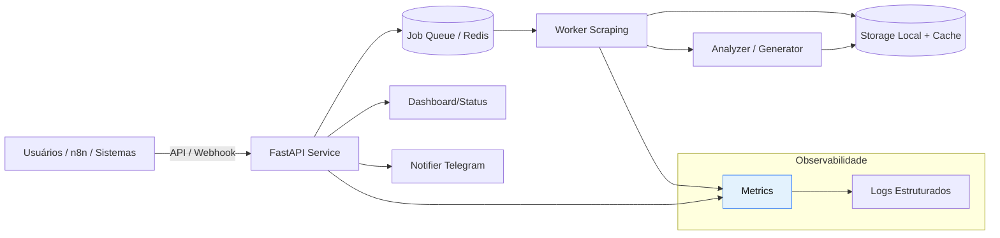

# 🏥 Doctoralia Scraper

Automação profissional para monitorar, analisar e responder avaliações médicas (Doctoralia e futuras fontes) com scraping resiliente, geração inteligente de respostas, API REST, integração n8n e observabilidade.

[](https://python.org) [](#-%EF%B8%8F-comandos-make-top-10) [](#-%F0%9F%A7%AA-testes--qualidade) [](LICENSE.md)

## ✨ Principais Capacidades

- 🔍 Scraping robusto (anti-bloqueio, retries, circuit breaker, delays dinâmicos)
- 🤖 Geração e análise de respostas (sentimento, qualidade, templates)
- 📡 API REST versionada + jobs assíncronos + webhooks assinados
- 🪄 Integração n8n (workflows completos: sync, async, batch, webhook)
- 📊 Dashboard / métricas / health / performance monitor
- 📱 Notificações (Telegram) + extensível a outros canais
- 🛡️ Segurança (rate limit, masking, assinatura HMAC, config isolada)

## 🚀 Início Rápido (5 passos)

```bash
git clone <REPO_URL>
cd doctoralia-scrapper
make install            # instala dependências
cp config/config.example.json config/config.json
make run-url URL=https://www.doctoralia.com.br/medico/exemplo/especialidade/cidade
```

Ver resultado no terminal ou iniciar dashboard:

```bash
make dashboard   # http://localhost:5000
```

Mais detalhes: veja `docs/quickstart.md`.

## 🏗️ Arquitetura (Visão Geral)



Arquitetura completa e componentes: `docs/overview.md`.

## 📦 Estrutura Essencial

```text
├── main.py              # CLI / entrypoints simplificados
├── src/                 # Código fonte
├── config/              # Configurações e templates
├── docs/                # Nova documentação modular
├── scripts/             # Automação & utilidades
├── tests/               # Testes
└── data/                # Saída (logs, extrações, respostas)
```

## 🔌 API Rápida

```bash
make api        # http://localhost:8000/docs
curl -X POST http://localhost:8000/v1/scrape:run \
  -H "X-API-Key: <KEY>" -H 'Content-Type: application/json' \
  -d '{"doctor_url": "https://www.doctoralia.com.br/medico/exemplo"}'
```

Endpoints principais e modelos: `docs/api.md`.

## 🧪 Testes & Qualidade

```bash
make test          # roda suíte completa
make lint          # estilo e estática
make security      # bandit / safety
make format        # black + isort
```

Padrões de desenvolvimento: `docs/development.md`.

## ⚙️ Configuração Resumida

- Ajuste `config/config.json` (scraping, delays, telegram, limites)
- Variáveis sensíveis via `.env` (ex: API_KEY, WEBHOOK_SECRET)
- Templates e customização: `docs/templates.md`

## 📡 n8n Workflows

Importe exemplos em `examples/n8n/` e siga guia unificado: `docs/n8n.md`.

## 🛠️ Comandos Make (Top 10)

| Comando | Descrição |
|---------|-----------|
| make install | Instala dependências |
| make run-url URL=... | Scraping rápido de uma URL |
| make run-full-url URL=... | Scraping + geração + análise |
| make dashboard | Inicia dashboard local |
| make api | Sobe API REST |
| make analyze | Análise de qualidade interativa |
| make daemon | Loop contínuo / agendado |
| make status | Estado geral do sistema |
| make test | Executa testes |
| make health | Health / verificação ambiente |

Lista completa: `make help`.

## 🛡️ Segurança (Checklist)

- [ ] Definir `API_KEY` forte
- [ ] Definir `WEBHOOK_SECRET`/`WEBHOOK_SIGNING_SECRET`
- [ ] Ativar masking de PII se aplicável
- [ ] Limitar exposição de portas externamente
- [ ] Backup periódico de `data/` (extrações + respostas)
- [ ] Revisar logs antes de enviar para terceiros

Detalhes: `docs/operations.md` & `docs/deployment.md`.

## 🧩 Extensão & Customização

- Adicionar novas plataformas: criar adaptador em `multi_site_scraper.py`
- Ajustar heurísticas de espera / retry no circuit breaker
- Substituir analisador de sentimento: implementar nova strategy em `response_quality_analyzer.py`

## 🗂️ Documentação Modular

| Arquivo | Conteúdo |
|---------|----------|
| docs/quickstart.md | Guia rápido completo |
| docs/overview.md | Arquitetura + componentes |
| docs/api.md | Endpoints, auth, exemplos |
| docs/n8n.md | Integração e workflows |
| docs/deployment.md | Docker / produção enxuto |
| docs/operations.md | Monitoramento, backup, troubleshooting |
| docs/development.md | Dev env, padrões, testes |
| docs/templates.md | Templates de respostas/notificações |
| docs/changelog.md | Histórico de mudanças |

## 🤝 Contribuição

Fluxo resumido:

```bash
git checkout -b feat/minha-feature
make lint test
git commit -m "feat: adiciona <descrição curta>"
git push origin feat/minha-feature
```

Guia completo em `CONTRIBUTING.md`.

## 📄 Licença

Uso restrito / interno. Não redistribuir sem autorização.

## 📞 Suporte Rápido

```bash
make health
python scripts/system_diagnostic.py
```

Ou abra uma issue (inclua logs relevantes de `data/logs/`).

## 📆 Changelog

Veja `docs/changelog.md` para histórico estruturado.
