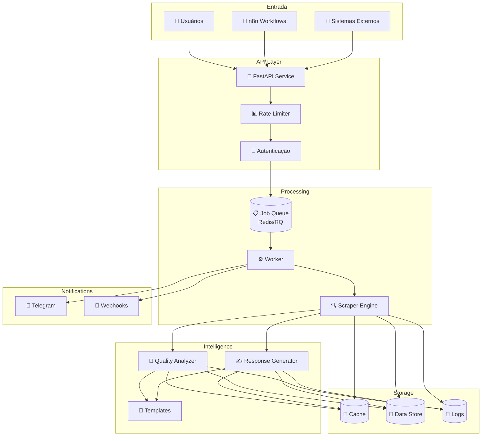

<div align="center">

# 🏥 Doctoralia Scraper

### Sistema Profissional de Monitoramento e Resposta a Avaliações Médicas

[](https://python.org)
[](https://fastapi.tiangolo.com)
[](https://docker.com)
[](LICENSE)

[](https://github.com/bernardopg/doctoralia-scrapper/actions/workflows/ci.yml)
[](tests/)
[](https://github.com/psf/black)
[](https://github.com/PyCQA/bandit)

**[📖 Documentação](docs/) • [🚀 Início Rápido](#-início-rápido) • [🔌 API](#-api-rest) • [🤝 Contribuir](CONTRIBUTING.md)**

</div>

---

## 📋 Índice

- [Sobre](#-sobre)
- [Funcionalidades](#-funcionalidades)
- [Início Rápido](#-início-rápido)
- [Arquitetura](#-arquitetura)
- [API REST](#-api-rest)
- [Configuração](#-configuração)
- [Integrações](#-integrações)
- [Testes](#-testes)
- [Segurança](#-segurança)
- [Contribuindo](#-contribuindo)
- [Licença](#-licença)

---

## 📖 Sobre

O **Doctoralia Scraper** é uma solução completa e profissional para automação de monitoramento, análise e resposta a avaliações médicas em plataformas como Doctoralia.

Desenvolvido com foco em **resiliência**, **segurança** e **extensibilidade**, o sistema oferece:

- 🔍 **Web Scraping Robusto** — Anti-bloqueio, retries inteligentes, circuit breaker
- 🤖 **Análise Inteligente** — Detecção de sentimento, categorização automática
- 📡 **API REST Completa** — Endpoints versionados, webhooks, jobs assíncronos
- 🪄 **Automação Total** — Integração nativa com n8n para workflows complexos
- 📊 **Observabilidade** — Dashboard, métricas, logs estruturados, health checks

---

## ✨ Funcionalidades

### Core
| Funcionalidade | Descrição |
|----------------|-----------|
| 🔍 **Scraping Resiliente** | Coleta automatizada com anti-detecção, delays dinâmicos e recuperação de falhas |
| 🤖 **Geração de Respostas** | Templates inteligentes baseados em sentimento e categoria |
| 📊 **Análise de Qualidade** | Score de sentimento, detecção de urgência, métricas de engajamento |
| 💾 **Cache Inteligente** | Evita reprocessamento e otimiza recursos |

### Infraestrutura
| Funcionalidade | Descrição |
|----------------|-----------|
| 📡 **API REST v1** | Endpoints completos com autenticação e rate limiting |
| ⚡ **Jobs Assíncronos** | Processamento em background com Redis/RQ |
| 🔔 **Webhooks** | Notificações assinadas (HMAC) para eventos |
| 📱 **Telegram Bot** | Alertas e notificações em tempo real |

### DevOps
| Funcionalidade | Descrição |
|----------------|-----------|
| 🐳 **Docker Ready** | Imagens otimizadas para produção |
| 🔄 **CI/CD** | GitHub Actions para testes, lint e deploy |
| 📈 **Monitoramento** | Dashboard web, métricas de performance |
| 🛡️ **Segurança** | Bandit, Safety, masking de PII |

---

## 🚀 Início Rápido

### Pré-requisitos

- Python 3.10+
- [Poetry](https://python-poetry.org/) (recomendado) ou pip
- Chrome/Chromium (para Selenium)
- Redis (opcional, para jobs assíncronos)

### Instalação

```bash
# Clone o repositório
git clone https://github.com/bernardopg/doctoralia-scrapper.git
cd doctoralia-scrapper

# Instale as dependências
make install

# Configure o ambiente
cp .env.example .env
cp config/config.example.json config/config.json

# Edite as configurações conforme necessário
nano config/config.json
```

### Uso Básico

```bash
# Scraping simples de uma URL
make run-url URL="https://www.doctoralia.com.br/medico/nome/especialidade/cidade"

# Scraping completo com análise e geração de respostas
make run-full-url URL="https://www.doctoralia.com.br/medico/nome/especialidade/cidade"

# Iniciar dashboard web
make dashboard  # http://localhost:5000

# Iniciar API REST
make api  # http://localhost:8000/docs
```

### 🔄 Comandos de Atualização

```bash
# Verificar atualizações disponíveis
make update-check

# Atualizar TUDO (dependências + chromedriver + nltk)
make update

# Atualizar apenas dependências Python
make update-deps

# Atualizar ChromeDriver
make update-drivers

# Atualizar recursos NLTK
make update-nltk

# Atualização completa incluindo git pull
make update-all
```

📚 Consulte o [Guia Rápido Completo](docs/quickstart.md) para mais detalhes.

---

## 🏗️ Arquitetura



### Estrutura de Diretórios

```
doctoralia-scrapper/
├── 📁 src/                    # Código fonte principal
│   ├── api/                   # API REST (FastAPI)
│   ├── integrations/          # Integrações externas (n8n)
│   └── jobs/                  # Sistema de jobs assíncronos
├── 📁 config/                 # Configurações e templates
├── 📁 docs/                   # Documentação completa
├── 📁 scripts/                # Scripts de automação
├── 📁 tests/                  # Suíte de testes
├── 📁 examples/               # Exemplos e workflows n8n
├── 📁 templates/              # Templates HTML (dashboard)
└── 📁 data/                   # Dados de saída (logs, extrações)
```

📚 Veja a [Visão Geral da Arquitetura](docs/overview.md) para mais detalhes.

---

## 🔌 API REST

A API REST oferece endpoints completos para integração com sistemas externos.

### Autenticação

```bash
# Header de autenticação
X-API-Key: sua_chave_secreta
```

### Endpoints Principais

| Método | Endpoint | Descrição |
|--------|----------|-----------|
| `POST` | `/v1/scrape:run` | Executa scraping síncrono (retorna resultados imediatamente) |
| `POST` | `/v1/jobs` | Cria job assíncrono (retorna job_id para polling) |
| `GET` | `/v1/jobs/{job_id}` | Consulta status e resultado de um job |
| `POST` | `/v1/hooks/n8n/scrape` | Webhook dedicado para integração n8n |
| `GET` | `/v1/health` | Health check básico |
| `GET` | `/v1/ready` | Readiness check com diagnóstico de componentes |
| `GET` | `/v1/metrics` | Métricas de performance da API |
| `GET` | `/v1/version` | Versão da API e uptime |

### Exemplo de Uso

```bash
# Scraping síncrono
curl -X POST http://localhost:8000/v1/scrape:run \
  -H "X-API-Key: sua_chave" \
  -H "Content-Type: application/json" \
  -d '{
    "doctor_url": "https://www.doctoralia.com.br/medico/exemplo",
    "include_analysis": true,
    "include_generation": false
  }'

# Resposta (UnifiedResult)
{
  "doctor": {
    "id": "12345",
    "name": "Dr. João Silva",
    "specialty": "Cardiologia",
    "rating": 4.8,
    "profile_url": "https://..."
  },
  "reviews": [
    {
      "id": "r1",
      "rating": 5,
      "text": "Excelente profissional!",
      "author": {"name": "Maria Santos", "is_verified": true}
    }
  ],
  "analysis": {
    "sentiments": {"compound": 0.85, "positive": 0.78},
    "quality_score": 85.0
  },
  "metrics": {
    "scraped_count": 10,
    "duration_ms": 5234
  },
  "status": "completed"
}
```

📚 **Documentação completa da API**: [docs/api.md](docs/api.md)

📖 **Swagger UI**: http://localhost:8000/docs (quando a API estiver rodando)

---

## ⚙️ Configuração

### Variáveis de Ambiente

```bash
# .env
API_KEY=sua_chave_api_segura
WEBHOOK_SECRET=segredo_para_assinatura_hmac
TELEGRAM_BOT_TOKEN=token_do_bot
TELEGRAM_CHAT_ID=id_do_chat
REDIS_URL=redis://localhost:6379/0
```

### Arquivo de Configuração

```json
// config/config.json
{
  "scraping": {
    "headless": true,
    "timeout": 30,
    "retry_attempts": 3,
    "delay_between_requests": [2, 5]
  },
  "api": {
    "rate_limit": "100/minute",
    "cors_origins": ["*"]
  },
  "notifications": {
    "telegram_enabled": true,
    "webhook_enabled": true
  }
}
```

📚 Guia completo: [docs/templates.md](docs/templates.md)

---

## 🔗 Integrações

### n8n Workflows

O projeto inclui workflows prontos para n8n:

| Workflow | Descrição |
|----------|-----------|
| `sync-scraping-workflow.json` | Scraping síncrono simples |
| `async-webhook-workflow.json` | Jobs assíncronos com callbacks |
| `batch-processing-workflow.json` | Processamento em lote |
| `complete-doctoralia-workflow.json` | Workflow completo com todas as features |

```bash
# Importar workflows no n8n
examples/n8n/*.json
```

📚 Guia de integração: [docs/n8n.md](docs/n8n.md)

### Telegram Bot

Configure notificações em tempo real:

```bash
# Ativar notificações
TELEGRAM_BOT_TOKEN=seu_token
TELEGRAM_CHAT_ID=seu_chat_id
```

---

## 🧪 Testes

```bash
# Executar todos os testes
make test

# Testes com cobertura
make test-coverage

# Apenas testes críticos
pytest -k critical

# Lint e formatação
make lint
make format

# Verificação de segurança
make security
```

### Cobertura de Testes

| Módulo | Cobertura |
|--------|-----------|
| `src/scraper.py` | 92% |
| `src/api/` | 88% |
| `src/response_generator.py` | 85% |
| **Total** | **~85%** |

---

## 🛡️ Segurança

### Práticas Implementadas

- ✅ **Autenticação** — API Key obrigatória para todos os endpoints
- ✅ **Rate Limiting** — Proteção contra abuso
- ✅ **HMAC Signing** — Webhooks assinados para verificação
- ✅ **PII Masking** — Ocultação de dados sensíveis em logs
- ✅ **Dependency Scanning** — Safety e Dependabot configurados
- ✅ **SAST** — Análise estática com Bandit

### Checklist de Segurança

```bash
# Verificar dependências vulneráveis
make security

# Análise estática
bandit -r src/
```

📚 Política completa: [SECURITY.md](SECURITY.md)

---

## 🤝 Contribuindo

Contribuições são bem-vindas! Por favor, leia nosso guia:

1. Fork o repositório
2. Crie uma branch para sua feature (`git checkout -b feat/nova-feature`)
3. Faça commit das mudanças (`git commit -m 'feat: adiciona nova feature'`)
4. Push para a branch (`git push origin feat/nova-feature`)
5. Abra um Pull Request

### Padrões

- **Commits**: [Conventional Commits](https://www.conventionalcommits.org/)
- **Código**: [Black](https://black.readthedocs.io/) + [isort](https://pycqa.github.io/isort/)
- **Testes**: Mínimo 80% de cobertura para novas features

📚 Guia completo: [CONTRIBUTING.md](CONTRIBUTING.md)

---

## 📚 Documentação

| Documento | Descrição |
|-----------|-----------|
| [Guia Rápido](docs/quickstart.md) | Início rápido passo a passo |
| [Arquitetura](docs/overview.md) | Visão geral do sistema |
| [API Reference](docs/api.md) | Documentação completa da API |
| [n8n Integration](docs/n8n.md) | Workflows e integrações n8n |
| [Deploy](docs/deployment.md) | Guia de deploy para produção |
| [Operações](docs/operations.md) | Monitoramento e manutenção |
| [Desenvolvimento](docs/development.md) | Setup do ambiente de dev |
| [Templates](docs/templates.md) | Customização de templates |
| [Changelog](CHANGELOG.md) | Histórico de mudanças |

---

## 📄 Licença

Este projeto está licenciado sob a **MIT License** - veja o arquivo [LICENSE](LICENSE) para detalhes.

---

## 📞 Suporte

- 📝 [Abrir Issue](https://github.com/bernardopg/doctoralia-scrapper/issues/new/choose)
- 📧 Contato: [issues do projeto]

```bash
# Diagnóstico rápido
make health
python scripts/system_diagnostic.py
```

---

<div align="center">

**Feito com ❤️ para a comunidade médica**

[⬆ Voltar ao topo](#-doctoralia-scraper)

</div>
