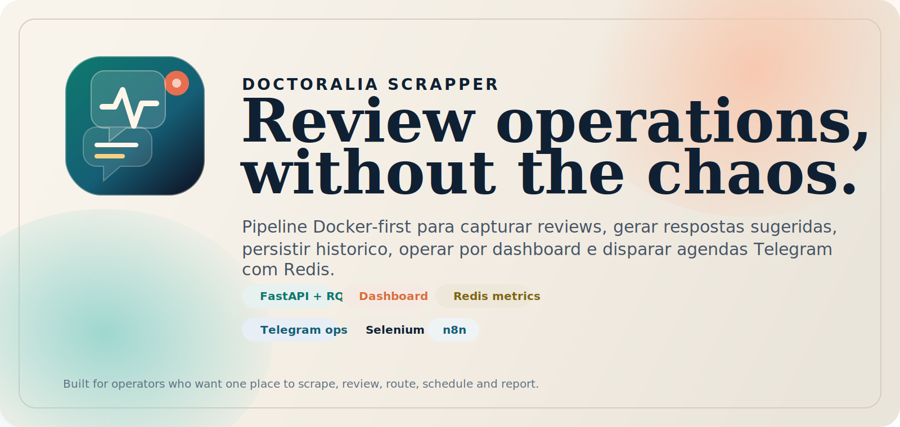
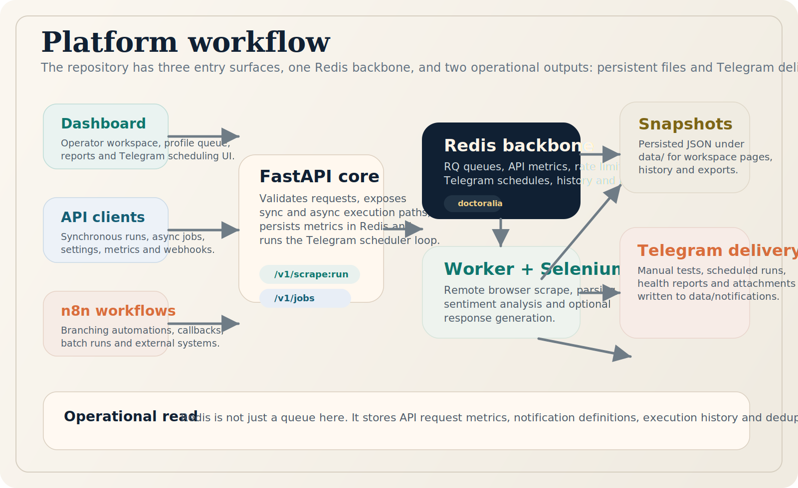
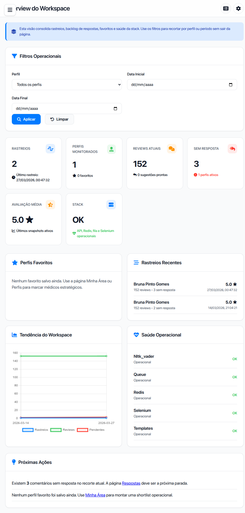
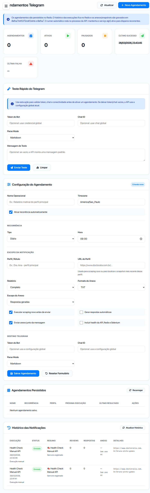

# Doctoralia Scrapper Wiki

> Hub central da documentação. Use esta página como porta de entrada para operação, arquitetura, integrações e manutenção do projeto.

## O que este repositório entrega

Doctoralia Scrapper é uma plataforma Docker-first para coletar reviews do Doctoralia, analisar sentimento, gerar respostas sugeridas, operar tudo por dashboard, expor uma API consistente e disparar relatórios Telegram com agendamento persistido em Redis.

## Rotas rápidas

| Se você precisa de... | Vá para |
|---|---|
| Subir o projeto em poucos minutos | [Quickstart](quickstart.md) |
| Entender a arquitetura e o fluxo geral | [Visão Geral](overview.md) |
| Operar o workspace web | [Dashboard Workspace](dashboard-workspace.md) |
| Configurar agendamentos Telegram | [Telegram Notifications](telegram-notifications.md) |
| Integrar via API | [API REST](api.md) |
| Orquestrar com n8n | [n8n](n8n.md) |
| Fazer troubleshooting e monitoramento | [Operations](operations.md) |
| Contribuir e desenvolver localmente | [Development](development.md) |
| Preparar deploy | [Deployment](deployment.md) |
| Ajustar templates e mensagens | [Templates](templates.md) |
| Melhorar a vitrine do repositório | [About & Repo Metadata](about.md) |

## Mapa visual do sistema

## Tour visual

<table>
  <tr>
    <td width="50%">
      
    </td>
    <td width="50%">
      
    </td>
  </tr>
  <tr>
    <td><strong>Workspace Overview</strong> Visão consolidada de perfis, reviews, pendências, histórico e saúde operacional.</td>
    <td><strong>Telegram Scheduling</strong> Formulário completo para recorrência, scraping, geração, anexos, health e histórico persistido.</td>
  </tr>
</table>

## Escolha sua trilha

### Operação diária

1. Leia [Quickstart](quickstart.md).
2. Use [Dashboard Workspace](dashboard-workspace.md).
3. Feche com [Operations](operations.md).

### Automação e integrações

1. Comece em [API REST](api.md).
2. Compare scheduler interno e fluxos externos em [Telegram Notifications](telegram-notifications.md) e [n8n](n8n.md).
3. Consulte [Templates](templates.md) para padronizar mensagens.

### Evolução técnica

1. Revise [Visão Geral](overview.md).
2. Entre em [Development](development.md).
3. Use [Deployment](deployment.md) quando sair do ambiente local.

## Fatos operacionais que valem lembrar

- O backbone do projeto hoje é Redis: fila RQ, métricas da API, agendamentos Telegram, locks e histórico de notificações.
- O scheduler recorrente de Telegram roda no processo da API. Se `api` parar, as recorrências param junto.
- `http://localhost:6379` no navegador não valida Redis. O teste correto é `docker compose exec -T redis redis-cli ping`.
- O dashboard é uma superfície operacional de verdade, não só observabilidade: ele faz proxy da API, gerencia settings, histórico, respostas e agendamentos.

## Meta do repositório

O objetivo não é apenas raspar reviews. O objetivo é transformar scraping em rotina operacional: captar, analisar, priorizar, responder, registrar histórico e distribuir informação no canal certo sem perder rastreabilidade.

## Próximos documentos recomendados

- [About & Repo Metadata](about.md)
- [Quickstart](quickstart.md)
- [Telegram Notifications](telegram-notifications.md)
