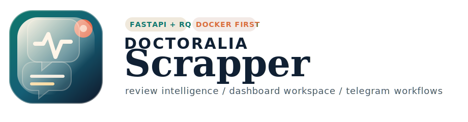
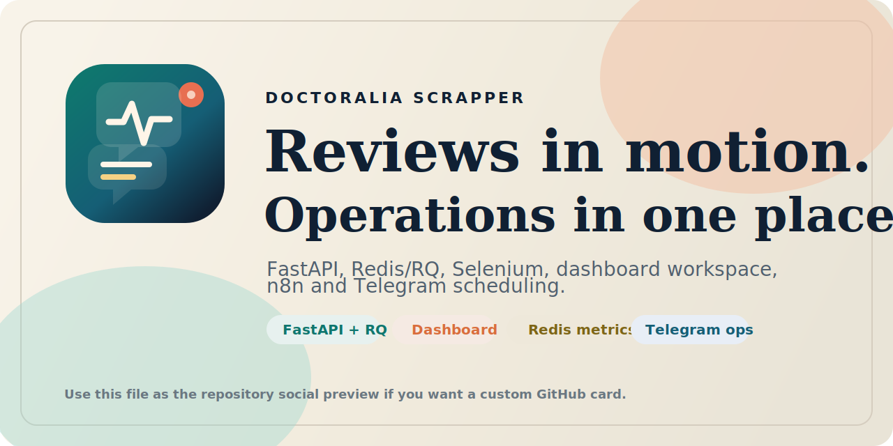

# About & Repo Metadata

> Esta página organiza a vitrine do repositório: descrição curta, texto de apoio, assets visuais e tópicos recomendados para GitHub.

## Posicionamento sugerido

Doctoralia Scrapper é um workspace operacional para reviews médicos: coleta via Selenium, processa via FastAPI + Redis/RQ, organiza snapshots, sugere respostas e agenda relatórios Telegram com histórico persistido.

## Sugestão de descrição curta para o GitHub About

Plataforma Docker-first para scraping de reviews Doctoralia, geração de respostas e notificações Telegram com FastAPI, Redis/RQ, Selenium, dashboard e n8n.

## Sugestão de tagline ampliada

Capture reviews, transforme em backlog acionável, gere respostas e rode uma rotina operacional completa com API, dashboard, Redis e Telegram.

## Tópicos recomendados

```text
fastapi
flask
redis
rq
selenium
telegram-bot
n8n
docker
scraping
review-automation
doctoralia
observability
```

## Asset recomendado para social preview

Use [social-card.svg](assets/social-card.svg) como base para o preview social do repositório no GitHub.



## Vocabulário visual adotado

- Base clara e editorial, não dark genérico.
- Paleta quente com teal, azul petróleo, coral e dourado para manter sinal visual de produto operacional.
- Marca própria com bolha de conversa + pulso, para unir review, resposta e monitoramento sem depender da identidade oficial da plataforma de terceiros.

## Arquivos de marca adicionados

| Asset | Uso recomendado |
|---|---|
| [assets/logo.svg](assets/logo.svg) | README, wiki, apresentações e docs internas |
| [assets/banner.svg](assets/banner.svg) | Hero do README e landing visual do projeto |
| [assets/social-card.svg](assets/social-card.svg) | Social preview do GitHub |
| [assets/workflow-platform.svg](assets/workflow-platform.svg) | Visão sistêmica da arquitetura |
| [assets/workflow-telegram.svg](assets/workflow-telegram.svg) | Fluxo do scheduler Telegram |

## Observação importante

O campo **About** do GitHub, assim como a imagem de social preview, não é armazenado automaticamente no repositório. Esta página deixa tudo pronto, mas a aplicação final desses dois itens ainda precisa ser feita manualmente na interface do GitHub.

## Próximas leituras

- [Wiki Home](Home.md)
- [Visão Geral](overview.md)
- [Telegram Notifications](telegram-notifications.md)
