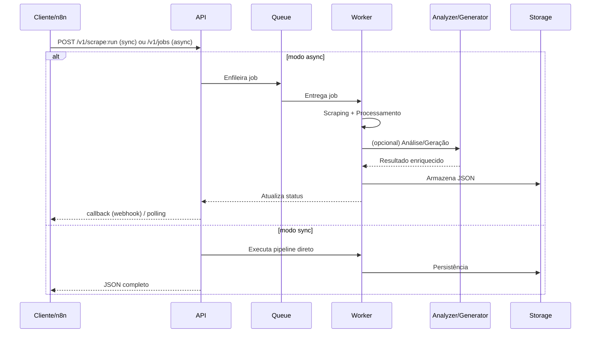

# 🧭 Visão Geral e Arquitetura

## Objetivo

Plataforma de automação para capturar, analisar e responder avaliações médicas com extensibilidade para múltiplas fontes, integrável via API e orquestradores (n8n), com foco em robustez operacional.

## Componentes Principais

| Componente | Papel | Observações |
|------------|-------|-------------|
| Scraper (Selenium) | Coleta páginas, extrai metadados e reviews | Delay adaptativo, retries, fallback |
| Multi Site Layer | Abstração para futuras plataformas | Hoje principal: Doctoralia |
| Response Generator | Geração de respostas template + heurísticas | Pode plugar LLM futuramente |
| Quality Analyzer | Sentimento / legibilidade / heurísticas | VADER + regras custom |
| API (FastAPI) | Interface programática v1 | Sync + async jobs + webhooks |
| Worker (RQ) | Processa jobs assíncronos intensivos | Redis como backend |
| Dashboard | Exposição de métricas e status | Flask / lightweight |
| Notifier | Telegram (extensível) | Alerta rápido de eventos |
| Performance Monitor | Coleta tempos/padrões de execução | Exportável para Prometheus (futuro) |

## Fluxo Alto Nível

1. Entrada (CLI / API / n8n webhook)
2. Validação e normalização da URL
3. Enfileiramento (async) ou execução direta (sync)
4. Scraping resiliente (coleta HTML + parsing)
5. Extração estruturada (reviews, perfil, métricas)
6. Análise (sentimento, qualidade) + geração de resposta (opcional)
7. Persistência em `data/extractions/`
8. Notificações e callback se configurado
9. Métricas + logs estruturados

## Diagrama de Sequência Simplificado

## Diretórios e Responsabilidades

| Diretório | Conteúdo |
|-----------|----------|
| `src/` | Código executável principal |
| `config/` | Config runtime + templates |
| `scripts/` | Automação operacional (diagnóstico, monitor, daemon) |
| `tests/` | Testes unitários/integrados |
| `data/` | Outputs, extrações, respostas, logs |
| `examples/n8n/` | Workflows prontos |
| `docs/` | Documentação modular |

## Padrões Técnicos

- Respostas estruturadas em JSON com chaves estáveis
- Logs preferencialmente em JSON (facilita análise)
- Erros expressivos: mensagem + tipo + contexto
- Uso de timeouts configuráveis para scraping e requests
- Separação clara: coordenação (API) vs execução (Worker)

## Métricas (Base)

| Métrica | Descrição |
|---------|-----------|
| scrape.duration_ms | Tempo total por URL |
| scrape.reviews_count | Número de avaliações extraídas |
| scrape.retry_count | Tentativas extras necessárias |
| quality.sentiment.compound | Score -1..1 |
| quality.readability | Índice heurístico |
| response.generated | Flag se resposta foi gerada |

## Escalabilidade Futuras (Roadmap Sugerido)

| Tema | Evolução |
|------|----------|
| Storage | Migrar para Postgres + S3-like para raw HTML |
| Métricas | Exportador Prometheus + Grafana |
| Observabilidade | Correlation IDs + tracing leve |
| Scraping | Paralelização distribuída + proxy pool |
| Geração | Plug LLM com caching semântico |
| Autenticação | JWT + RBAC básico |

## Estratégia de Erros

| Tipo | Ação |
|------|------|
| NetworkError | Retry exponencial limitado |
| RateLimit | Backoff + jitter |
| ParsingError | Log detalhado + captura HTML opcional |
| PlatformChange | Flag crítica + alerta manual |

## Segurança (Resumo)

- Sanitização de conteúdos antes de logs
- Mascarar PII se habilitado (nome parcial, tokens truncados)
- Segredos fora do repositório (`.env`, injetados em runtime)
- Validação de assinatura HMAC em callbacks de/para n8n

## Quando Usar Modo Async

Use async quando:

- URL envolve muitos reviews
- Fluxo inclui análise + geração intensiva
- Deve integrar com n8n sem bloquear

## Limpeza & Retenção

Sugestão operacional:

- Logs > 30 dias: rotacionar/apagar
- Extrações antigas agregadas: consolidar em relatórios
- Respostas geradas: versionar se editar manualmente

---
Mais detalhes operacionais: `docs/operations.md`. Autenticação e endpoints: `docs/api.md`.
