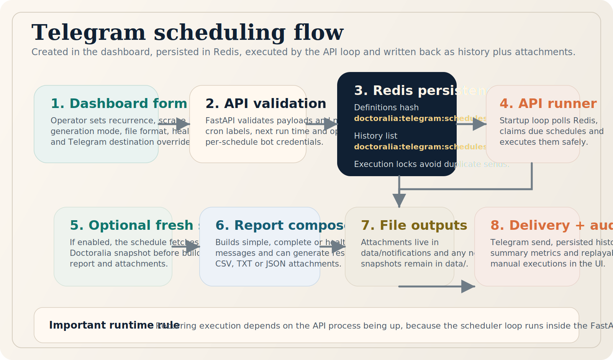

# Telegram Notifications

[Wiki Home](Home.md) · [Dashboard Workspace](dashboard-workspace.md) · [API REST](api.md) · [Operations](operations.md)

## O que existe hoje

O projeto já possui um scheduler Telegram funcional, persistido em Redis e acessível pelo dashboard em `/notifications/telegram/schedule`. Ele cobre:

- recorrência diária, dias úteis, semanal, intervalo fixo e cron customizado
- teste rápido de token e chat antes de ativar um fluxo
- scraping novo opcional antes do envio
- geração opcional de respostas automáticas
- formatos de anexo em `txt`, `json` e `csv`
- escopo do anexo em `responses`, `comments` ou `snapshot`
- relatórios `simple`, `complete` e `health`
- inclusão opcional do health da API, Redis e Selenium
- histórico persistido das execuções

## Onde isso vive

| Camada | Arquivo / rota |
|---|---|
| Dashboard | `/notifications/telegram/schedule` |
| Proxy Flask | `src/dashboard.py` |
| API FastAPI | `/v1/notifications/telegram/*` |
| Serviço principal | `src/services/telegram_schedule_service.py` |
| Schemas | `src/api/schemas/notifications.py` |
| Armazenamento | Redis + `data/notifications/` + `data/` |

## Chaves e armazenamento

| Item | Local |
|---|---|
| Definições dos agendamentos | `doctoralia:telegram:schedules:definitions` |
| Histórico das execuções | `doctoralia:telegram:schedules:history` |
| Locks de execução | `doctoralia:telegram:schedules:lock:*` |
| Anexos gerados | `data/notifications/` |
| Snapshots reaproveitados ou recém-criados | `data/` |

## Regra operacional mais importante

> O runner automático roda dentro do processo da API. Se o container ou processo `api` estiver parado, os disparos recorrentes deixam de acontecer.

## Fluxo operacional

1. O operador cria ou edita um agendamento no dashboard.
2. A API valida o payload e calcula `cron_expression`, `recurrence_label` e `next_run_at`.
3. O agendamento é salvo em Redis.
4. No startup, a API inicia o loop do scheduler.
5. Quando chega a hora, a API faz lock da execução.
6. Se configurado, um novo scraping é disparado e o snapshot é salvo.
7. O relatório é montado e o anexo opcional é escrito em disco.
8. O Telegram envia a mensagem.
9. O histórico é persistido e o próximo disparo é calculado.

## Endpoints principais

| Método | Endpoint | Uso |
|---|---|---|
| `GET` | `/v1/notifications/telegram/schedules` | Lista agendamentos e resumo |
| `POST` | `/v1/notifications/telegram/schedules` | Cria agendamento |
| `PUT` | `/v1/notifications/telegram/schedules/{schedule_id}` | Atualiza agendamento |
| `DELETE` | `/v1/notifications/telegram/schedules/{schedule_id}` | Remove agendamento |
| `POST` | `/v1/notifications/telegram/schedules/{schedule_id}/run` | Executa manualmente |
| `GET` | `/v1/notifications/telegram/history` | Lê histórico persistido |
| `POST` | `/v1/notifications/telegram/test` | Valida token/chat com envio real |

## Campos mais relevantes do payload

| Campo | Tipo | Descrição |
|---|---|---|
| `name` | `string` | Nome operacional do fluxo |
| `enabled` | `bool` | Ativa ou pausa a recorrência |
| `timezone` | `string` | Timezone IANA, ex. `America/Sao_Paulo` |
| `recurrence_type` | `string` | `daily`, `weekdays`, `weekly`, `interval`, `custom_cron` |
| `time_of_day` | `string` | Hora fixa em `HH:MM` |
| `profile_url` | `string` | URL do perfil Doctoralia para scraping ou lookup |
| `trigger_new_scrape` | `bool` | Faz scraping antes de montar o relatório |
| `include_generation` | `bool` | Gera respostas antes do envio |
| `generation_mode` | `string` | `default`, `local`, `openai`, `gemini`, `claude` |
| `report_type` | `string` | `simple`, `complete`, `health` |
| `include_health_status` | `bool` | Acrescenta saúde da stack ao relatório |
| `send_attachment` | `bool` | Anexa arquivo à mensagem |
| `attachment_scope` | `string` | `responses`, `comments`, `snapshot` |
| `attachment_format` | `string` | `txt`, `json`, `csv` |
| `telegram_token` | `string` | Override por agendamento |
| `telegram_chat_id` | `string` | Override por agendamento |

## Exemplo de criação

```json
{
  "name": "Resumo matinal da principal",
  "enabled": true,
  "timezone": "America/Sao_Paulo",
  "recurrence_type": "daily",
  "time_of_day": "09:00",
  "profile_label": "Dra. principal",
  "profile_url": "https://www.doctoralia.com.br/bruna-pinto-gomes",
  "trigger_new_scrape": true,
  "include_generation": true,
  "generation_mode": "local",
  "report_type": "complete",
  "include_health_status": true,
  "send_attachment": true,
  "attachment_scope": "responses",
  "attachment_format": "csv",
  "telegram_token": "",
  "telegram_chat_id": "",
  "parse_mode": "Markdown"
}
```

## Quando usar o scheduler interno

Use o scheduler interno quando:

- você quer uma rotina recorrente simples e autocontida
- o objetivo principal é relatório Telegram
- o fluxo não depende de branching externo complexo
- você quer histórico e replay direto no dashboard

## Quando usar n8n no lugar

Use n8n quando:

- o envio precisa acionar outros sistemas além do Telegram
- existe branching condicional, aprovação humana ou múltiplos destinos
- a rotina depende de planilhas, CRMs, Slack, e-mail ou webhooks externos

## Troubleshooting rápido

| Sintoma | O que verificar |
|---|---|
| Nada dispara no horário | Confirme se a API está rodando e se o agendamento está `enabled` |
| Teste manual funciona, recorrência não | Verifique timezone, `next_run_at` e se o loop não foi desabilitado |
| Mensagem envia sem anexo | Veja `send_attachment`, `attachment_scope`, `attachment_format` e permissões de escrita em `data/notifications` |
| Falha ao gerar respostas | Revise `generation_mode` e credenciais do provedor selecionado |
| Health incompleto | Confira conectividade entre API, Redis e Selenium |

## Próximas leituras

- [Dashboard Workspace](dashboard-workspace.md)
- [API REST](api.md)
- [Operations](operations.md)
